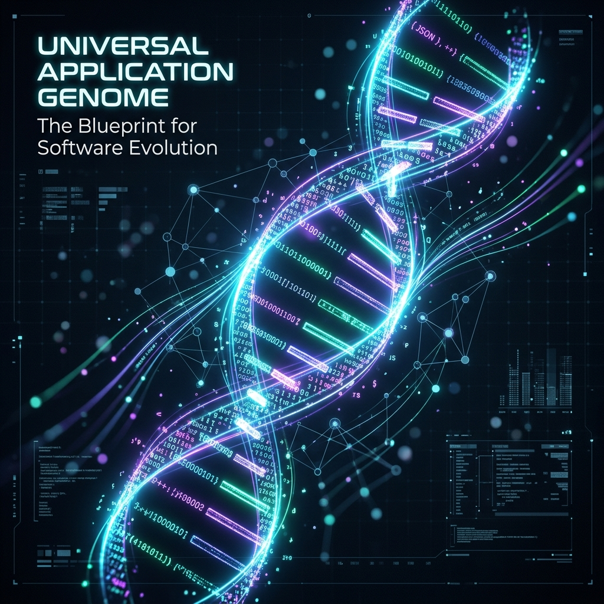
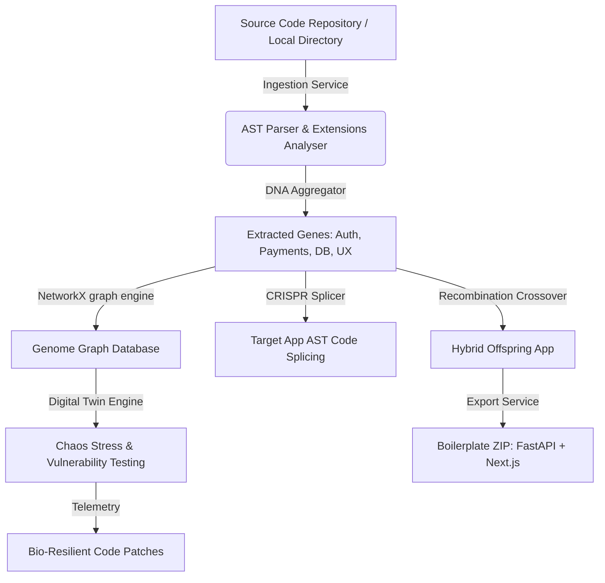
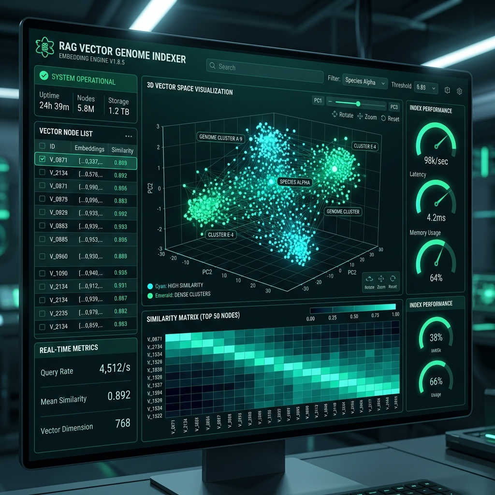

# 🧬 Universal Application Genome (UAG)



> **"Decode software. Learn its DNA. Splice features, stress-test digital twins, and evolve entirely new applications."**

[](LICENSE)
[](backend)
[](frontend)
[](backend)

Universal Application Genome (UAG) is a production-grade open-source platform that treats software codebases as living organisms. By parsing source files, UAG extracts abstract semantic **"genes"** (representing user experience layouts, security constraints, database structures, business layers, and event streams), maps them into a unified **Software Genome Graph**, simulates operational runs under chaos conditions, splices features via **CRISPR Code Editing**, and evolves entirely new hybrid platforms through **genome recombination**.

UAG is built to run fully locally without Docker, using SQLite, NetworkX graphs, and interfaces with a local Ollama service with built-in rule-based fallback semantics.

---

## 🧬 Architectural Design

The platform is structured into two main decoupled services:



---

## 🎨 Visual Showcase Gallery

| Module Interface | Description | Asset Preview |
| :--- | :--- | :--- |
| **Software Species Phylogeny Tree** | 3D visual evolutionary tree of software species | [](docs/SPECIES_TAXONOMY.md) |
| **Genome Recombination Matrix** | Multi-parent app crossover statistics & innovation metrics | [](docs/RECOMBINATION.md) |
| **Neural RAG Vector Indexer** | 3D embedding space visualization & cosine distance index | [](backend/app/services/rag_vector.py) |
| **CRISPR Code Splicer** | Autonomous feature splicing & split-screen AST code diff | [](docs/CRISPR_SPLICING_GUIDE.md) |
| **Digital Twin Chaos Lab** | Real-time load telemetry & bio-resilient auto-patching | [](docs/DIGITAL_TWIN_CHAOS.md) |

---

## 🔥 Key Platform Modules

### 1. ✂️ CRISPR-Code Editor (`/crispr`)
- **Autonomous Feature Splicing**: Select high-fidelity software genes (Stripe Payments, Zero-Trust JWT Auth, Real-Time WebSockets Sync, RAG Vector Search) from donor codebases.
- **AST Splicing Engine**: Automatically splices donor routers, schemas, and logic into target application genomes with conflict detection and live code diff previews.

### 2. ⚡ Digital Twin & Chaos Stress Simulator (`/simulation`)
- **Chaos Vector Injection**: Stress-test application genomes under DDOS SYN floods, AST SQL injection exploits, and memory heap leaks.
- **Interactive Intensity Slider**: Adjust stress levels from 1 to 10 to simulate up to 200,000 requests/sec.
- **Bio-Resilient Auto-Patching**: Generates adaptive code patches (circuit breakers, token buckets, parameterized AST bindings) to fix vulnerabilities live.

### 3. 🕸️ Software Genome Graph (`/genome-graph`)
- Interactive Cytoscape.js canvas displaying compound clusters, module relationships, API nodes, and dependency links with integrated code preview.

### 4. 🧬 Evolution & Recombination Sandbox (`/evolution`)
- Combine multiple parent application genomes to create hybrid offspring applications, complete with downloadable FastAPI + Next.js boilerplate archives.

### 5. 🔬 Species Research Taxonomy (`/research`)
- Track parent-offspring family trees, patent similarity indexes, and sustainability computing footprints.

---

## 🚀 Setup & Execution (No Docker)

### System Prerequisites
Ensure you have the following installed on your host system:
- **Python 3.10+**
- **Node.js 18+ & NPM**

---

### Step 1: Start the Backend Server

1. Navigate to the `backend` directory:
   ```bash
   cd backend
   ```
2. Create and activate a Python virtual environment:
   ```bash
   python -m venv .venv
   # Windows:
   .venv\Scripts\activate
   # Linux/macOS:
   source .venv/bin/activate
   ```
3. Install dependencies:
   ```bash
   pip install -r requirements.txt
   ```
4. Run the development server:
   ```bash
   python run.py
   ```
   The API will mount at `http://127.0.0.1:8000`. You can inspect endpoints via Swagger UI at `http://127.0.0.1:8000/docs`.

---

### Step 2: Start the Frontend Application

1. Navigate to the `frontend` directory:
   ```bash
   cd ../frontend
   ```
2. Install npm packages:
   ```bash
   npm install
   ```
3. Run the development server:
   ```bash
   npm run dev
   ```
   Open your browser and navigate to `http://localhost:3000`.

---

## 📡 Local AI Integration (Ollama)
UAG will automatically establish client connections to a local Ollama service at `http://localhost:11434/api/chat` using model `deepseek-coder:6.7b` (or your customized model tag).

*If Ollama is not active or running, the UAG backend automatically switches to its high-fidelity local semantic rule analyzer. This parses files, detects dependencies, outlines architectures, and recombines genomes deterministically, guaranteeing zero setup delays.*

---

## 📄 License

This project is open source and available under the [MIT License](LICENSE). Copyright (c) 2026 Vijay Mahes.
