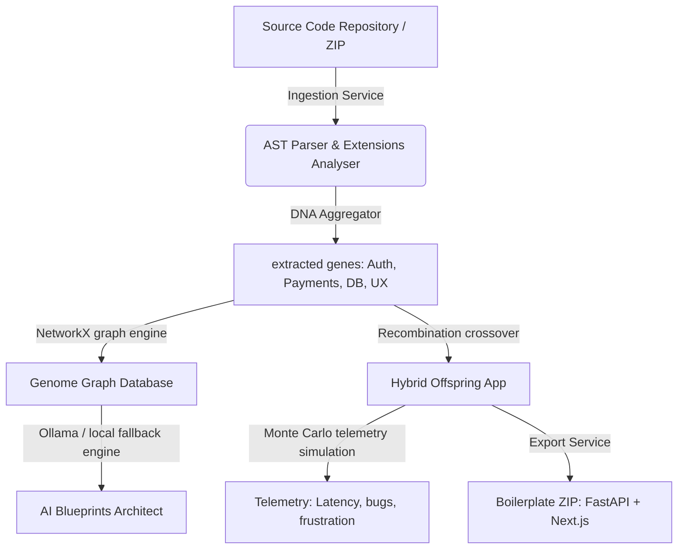

# Universal Application Genome (UAG)

> **"Decode software. Learn its DNA. Create entirely new applications."**

Universal Application Genome (UAG) is a production-grade open-source platform that treats software codebases as living organisms. By parsing source files, UAG extracts abstract semantic **"genes"** (representing user experience layouts, security constraints, database structures, business layers, and event streams), maps them into a unified **Software Genome Graph**, simulates operational runs, and evolves entirely new hybrid platforms through **genome recombination**.

UAG is built to run fully locally without Docker, using SQLite, NetworkX graphs, and interfaces with a local Ollama service with built-in rule-based fallback semantics.

---

## 🧬 Architectural Design

The platform is structured into two main decoupled services:



### 1. Backend Service (Python / FastAPI)
- **Ingestion Engine** (`backend/app/services/ingestion.py`): Recursively walks repositories, counts extensions ratios, parses syntax files, and extracts genes.
- **DNA Extraction Aggregator** (`backend/app/services/dna_extraction.py`): Collates individual genes into distinct categories (Business, UX, Architecture, Workflow) and runs taxonomy species classification.
- **Software Genome Graph** (`backend/app/services/genome_graph.py`): Formulates relationship structures linking parent nodes to modules, components, APIs, and table nodes.
- **Evolution Recombination & Mutation** (`backend/app/services/evolution.py`): Merges parent application genes, processes mutations (e.g. adding offline fallback sync hooks), and gauges fitness scores.
- **Simulation Sandbox** (`backend/app/services/simulation.py`): Predicts error vectors and latency constraints by running virtual Monte Carlo checks for 1000 UX journeys, scaling loads, and exploits.
- **Code Export Scaffolder** (`backend/app/services/export.py`): Packages generated SQLite schemas, FastAPI routers, and Next.js view containers into an exportable ZIP folder.

### 2. Frontend Web Interface (Next.js / TypeScript)
- **Landing Dashboard** (`frontend/src/app/page.tsx`): Overview metrics containing ingested apps, genes catalogued, and active evolved systems.
- **Ingestion portal** (`frontend/src/app/ingest/page.tsx`): Form layout allowing local file path entry, displaying file-by-file parser animations.
- **Genome Graph Explorer** (`frontend/src/app/genome-graph/page.tsx`): Interactive Cytoscape.js canvas showing compound clusters. Integrates Monaco Editor to preview code segments directly on click.
- **Recombination Sandbox** (`frontend/src/app/evolution/page.tsx`): Multi-select crossover panel displaying evolved gene metrics and ZIP downloads.
- **Simulations Dashboard** (`frontend/src/app/simulation/page.tsx`): Displays Monte Carlo log events and slider statistics.
- **Species Research Taxonomy** (`frontend/src/app/research/page.tsx`): Tracks parent-offspring family trees, patent similarities, and sustainability computing footprints.

---

## 🚀 Setup & Execution (No Docker)

### System Prerequisites
Ensure you have the following installed on your host system:
- **Python 3.10+**
- **Node.js 18+ & NPM**

---

### Step 1: Start the Backend Server

1. Navigate to the `backend` directory:
   ```bash
   cd backend
   ```
2. Create and activate a Python virtual environment:
   ```bash
   python -m venv .venv
   # Windows:
   .venv\Scripts\activate
   # Linux/macOS:
   source .venv/bin/activate
   ```
3. Install dependencies:
   ```bash
   pip install -r requirements.txt
   ```
4. Run the development server:
   ```bash
   python run.py
   ```
   The API will mount at `http://127.0.0.1:8000`. You can inspect endpoints via Swagger UI at `http://127.0.0.1:8000/docs`.

---

### Step 2: Start the Frontend Application

1. Navigate to the `frontend` directory:
   ```bash
   cd ../frontend
   ```
2. Install npm packages:
   ```bash
   npm install
   ```
3. Run the development server:
   ```bash
   npm run dev
   ```
   Open your browser and navigate to `http://localhost:3000`.

---

## 📡 Local AI Integration (Ollama)
UAG will automatically establish client connections to a local Ollama service at `http://localhost:11434/api/chat` using model `deepseek-coder:6.7b` (or your customized model tag).

*If Ollama is not active or running, the UAG backend automatically switches to its high-fidelity local semantic rule analyzer. This parses files, detects dependencies, outlines architectures, and recombines genomes deterministically, guaranteeing zero setup delays.*
