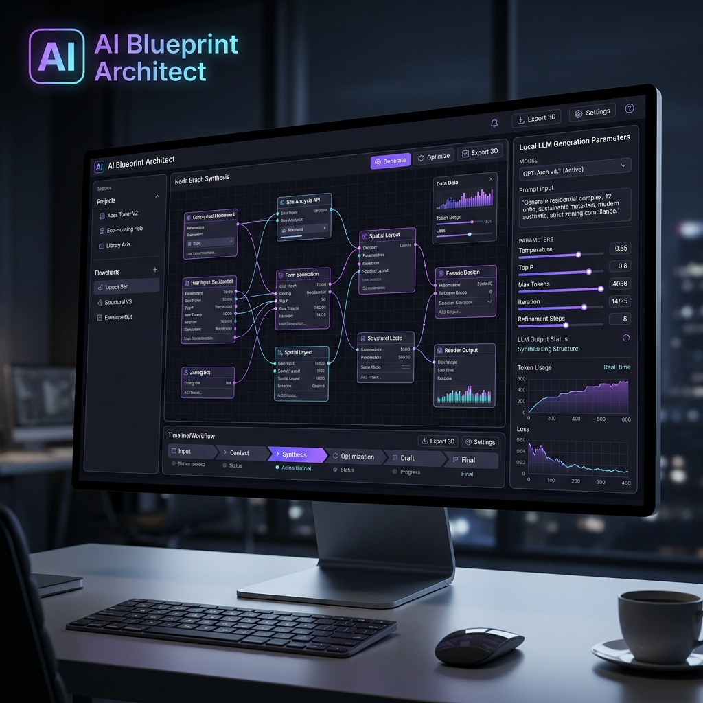

# 🤖 AI Blueprint Architect & Node Graph Synthesis

The AI Blueprint Architect generates component blueprints, router schemas, and NetworkX dependency flows using local Ollama or rule-based fallback engines.

## 🧩 Architectural Synthesis Pipeline

1. **Prompt & Target Species Selection**: Input application domain (e.g. Real-Time SaaS Core).
2. **Local Ollama Inference**: Connects to `http://localhost:11434/api/chat` with model `deepseek-coder:6.7b`.
3. **AST Node Graph Generation**: Constructs compound node graphs linking backend routers, database tables, and Next.js frontend pages.
4. **Boilerplate Compilation**: Exports executable zip packages containing FastAPI code and Next.js view containers.
