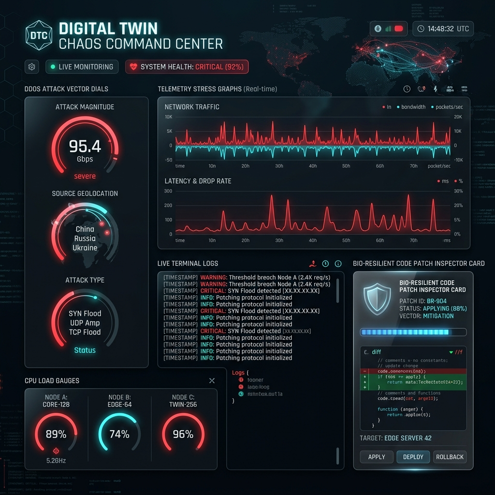

# ⚡ Digital Twin Chaos Stress Testing & Mitigation Guide

The Digital Twin Chaos Simulator injects cyber attacks and load stress vectors to evaluate bio-resilience.

## 🛡️ Supported Chaos Vectors

- **DDOS SYN Flood Spike**: Simulates up to 200,000 req/sec hitting API Gateway.
- **AST SQL Injection Threat**: Tests parameterized query interceptors against raw literal injections.
- **Heap Memory Leak Spike**: Monitors unbounded dictionary growths and triggers LRU purgers.
