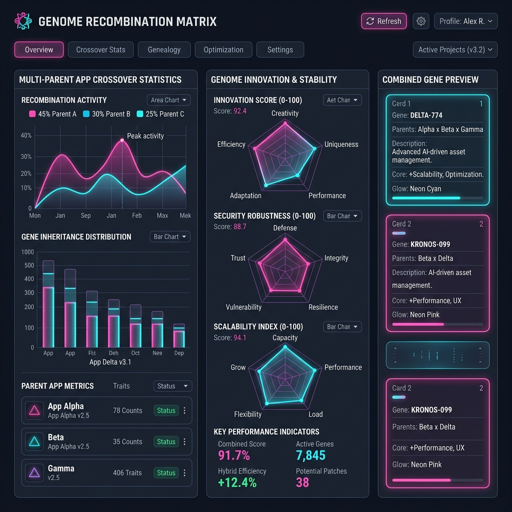

# 🧬 Genome Recombination & Crossover Matrix

Genome Recombination merges abstract semantic genes from multiple parent application genomes to evolve hybrid offspring codebases.

## 🔀 Crossover Algorithm

1. **Parent Genome Selection**: Select Parent A (e.g. E-Commerce Core) and Parent B (e.g. Realtime Analytics).
2. **Gene Extraction**: Identify non-conflicting operational genes across UX, Business, Security, and Architecture layers.
3. **AST Merging**: Execute topological sort on dependency graphs and splice parent routers into unified FastAPI & Next.js boilerplate structures.
4. **Fitness Score Evaluation**:
   - **Innovation Score**: Gauges feature diversity and crossover complexity.
   - **Security Score**: Measures presence of auth guards and input sanitizers.
   - **Scalability Score**: Predicts concurrency resilience under load.
