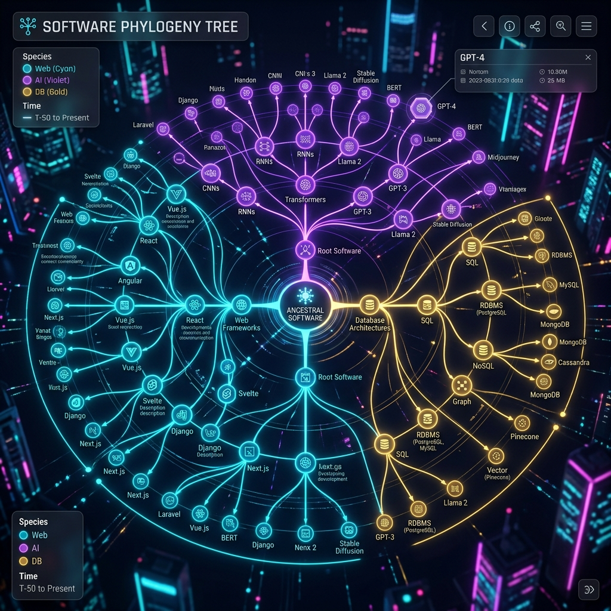

# 🔬 Software Species Taxonomy & Evolutionary Lineage

Universal Application Genome (UAG) classifies software codebases into distinct taxonomic species based on their structural, functional, and operational DNA.

## 🧬 Taxonomy Classification Matrix

| Species Domain | Primary Characteristics | Framework DNA | Typical Gene Types |
| :--- | :--- | :--- | :--- |
| **SaaS-Core Organism** | Multi-tenant auth, subscription router, billing webhooks | FastAPI + Next.js | JWT Auth, Stripe Checkout, Postgres ORM |
| **Realtime-Streamer** | WebSockets, pub/sub event broadcasting, low latency | Node / Go / FastAPI | ConnectionManager, EventBroadcaster |
| **Neural-RAG Engine** | Vector embeddings, cosine distance index, LLM retrieval | Python + NumPy / FAISS | VectorSearchEngine, EmbeddingIndexer |
| **Monolithic Sentinel** | Server-side rendering, relational DBs, monolith layout | Django / Rails | ORM Models, Middleware, Template Renderers |

## 🌳 Phylogenetic Lineage Algorithm
UAG calculates software species affinity scores using NetworkX AST graph similarity:
\[
\text{Affinity}(A, B) = \frac{|\text{Genes}(A) \cap \text{Genes}(B)|}{|\text{Genes}(A) \cup \text{Genes}(B)|} \times \text{StructuralSimilarity}(G_A, G_B)
\]
