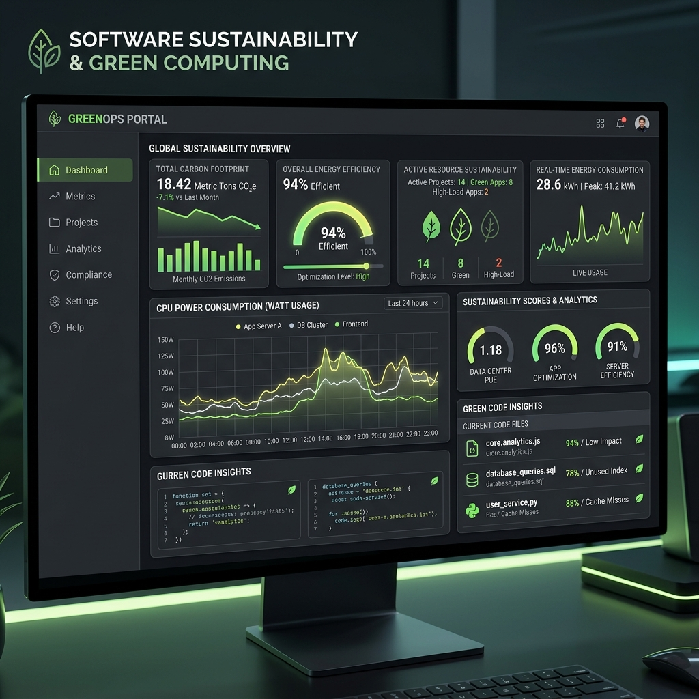

# 🌿 Green Computing & Software Sustainability Telemetry

The Sustainability Engine measures the environmental footprint, estimated watt usage, and CO2 carbon output per 1,000 requests across software application genomes.

## 📊 Carbon Telemetry Matrix

- **Energy Efficiency Ratio (EER)**: Measured in GFLOPs per watt.
- **Estimated Carbon Output**: Grams of CO2e per 10,000 executed API queries.
- **Green Compute Rating**: Rated A+ (FastAPI static cached) to C (Heavy recursive DB queries).
